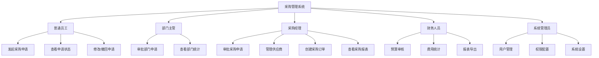
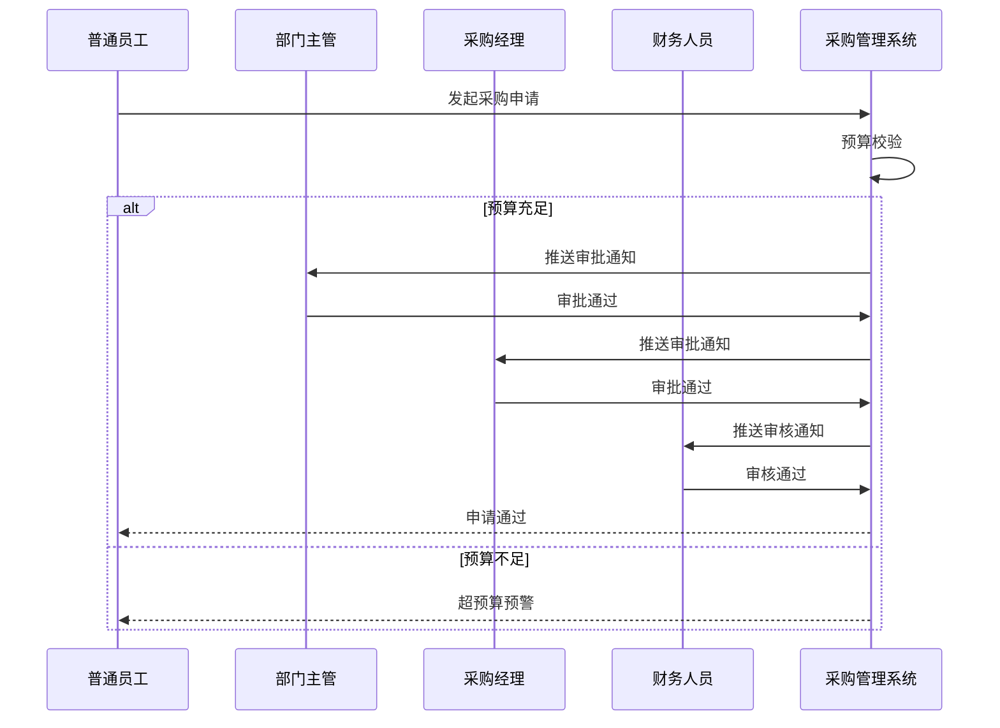

# 采购管理系统 - 功能点描述及用例文档

---

## 一、系统功能点描述

### 1.1 功能模块架构图

```
采购管理系统
├── 数据驾驶舱模块
│   ├── 采购趋势分析卡片
│   ├── 预算执行监控卡片
│   ├── 待办审批提醒卡片
│   ├── 供应商风险预警卡片
│   └── 品类采购热力图
├── 供应商管理模块
│   ├── 供应商列表管理
│   │   ├── 高级筛选
│   │   ├── 自定义列显示
│   │   ├── 批量操作
│   │   └── 导出导入
│   ├── 供应商详情
│   │   ├── 基本信息展示
│   │   ├── 信用评分卡片
│   │   ├── 合作记录时间轴
│   │   └── 资质到期预警
│   └── 供应商分布地图
│       └── 区域筛选功能
├── 采购申请模块
│   ├── 申请列表管理
│   │   ├── 列表视图/看板视图切换
│   │   ├── 状态筛选
│   │   └── 搜索功能
│   ├── 申请创建表单
│   │   ├── 物品明细录入
│   │   ├── 预算校验
│   │   └── 附件上传
│   └── 审批流程管理
│       ├── 审批节点展示
│       ├── 一键审批/批量审批
│       ├── 审批意见批注
│       └── 审批进度可视化
├── 采购订单模块
│   ├── 订单列表管理
│   ├── 订单创建
│   ├── 订单详情
│   │   ├── 状态进度条
│   │   └── 合同附件管理
│   └── 订单状态跟踪
├── 库存管理模块
│   ├── 物资台账管理
│   │   ├── 树形+表格联动
│   │   └── 库存预警提醒
│   └── 入库管理
│       └── 扫码入库模拟
├── 预算管理模块
│   ├── 预算设置
│   ├── 预算热力图
│   ├── 采购预测分析
│   └── 报表导出
└── 系统设置模块
    ├── 用户管理
    ├── 权限管理
    ├── 主题设置
    └── 操作日志
```

### 1.2 功能点详细描述

#### 数据驾驶舱模块

| 功能点 | 描述 | 优先级 |
| :--- | :--- | :--- |
| 采购趋势分析 | 展示月度采购金额趋势，支持下钻分析 | 高 |
| 预算执行监控 | 实时显示预算使用百分比，超预算预警 | 高 |
| 待办审批提醒 | 显示待处理审批数量，点击跳转 | 高 |
| 供应商风险预警 | 展示红/黄色风险供应商列表 | 高 |
| 品类采购热力图 | 各品类采购金额占比可视化 | 中 |

#### 供应商管理模块

| 功能点 | 描述 | 优先级 |
| :--- | :--- | :--- |
| 供应商列表 | 支持高级筛选、自定义列、批量操作 | 高 |
| 供应商新增/编辑 | 完整的供应商信息表单 | 高 |
| 供应商详情 | 信用评分、合作记录、资质管理 | 高 |
| 信用评分体系 | 星级展示、风险等级标签 | 高 |
| 分布地图 | 供应商地理位置可视化 | 中 |

#### 采购申请模块

| 功能点 | 描述 | 优先级 |
| :--- | :--- | :--- |
| 申请列表 | 列表/看板双视图切换 | 高 |
| 申请创建 | 物品明细录入、预算校验 | 高 |
| 申请修改/撤回 | 未审批状态可修改 | 高 |
| 审批流程 | 多级审批、实时推送 | 高 |
| 批量审批 | 一键流转、批量备注 | 中 |

#### 采购订单模块

| 功能点 | 描述 | 优先级 |
| :--- | :--- | :--- |
| 订单列表 | 状态筛选、高级搜索 | 高 |
| 订单创建 | 根据申请生成订单 | 高 |
| 订单详情 | 状态进度可视化 | 高 |
| 合同管理 | 附件预览、版本管理 | 中 |

#### 库存管理模块

| 功能点 | 描述 | 优先级 |
| :--- | :--- | :--- |
| 物资台账 | 树形+表格联动展示 | 高 |
| 入库管理 | 扫码入库模拟 | 高 |
| 库存预警 | 低库存自动提醒 | 高 |
| 库存调整 | 入库/出库操作 | 高 |

#### 预算管理模块

| 功能点 | 描述 | 优先级 |
| :--- | :--- | :--- |
| 预算设置 | 年度预算编制 | 高 |
| 预算监控 | 实时执行情况统计 | 高 |
| 报表分析 | 自定义维度生成报表 | 中 |
| 报表导出 | PDF/Excel格式导出 | 中 |

---

## 二、用例图

### 2.1 系统顶层用例图



### 2.2 采购申请审批用例图



---

## 三、用例描述表

### 3.1 用例总览

| 用例编号 | 用例名称 | 所属模块 | 执行者 |
| :--- | :--- | :--- | :--- |
| UC-001 | 发起采购申请 | 采购申请 | 普通员工 |
| UC-002 | 查看申请状态 | 采购申请 | 普通员工 |
| UC-003 | 修改采购申请 | 采购申请 | 普通员工 |
| UC-004 | 撤回采购申请 | 采购申请 | 普通员工 |
| UC-005 | 审批采购申请 | 采购申请 | 部门主管/采购经理 |
| UC-006 | 驳回采购申请 | 采购申请 | 部门主管/采购经理 |
| UC-007 | 批量审批 | 采购申请 | 采购经理 |
| UC-008 | 查看供应商列表 | 供应商管理 | 采购经理 |
| UC-009 | 查看供应商详情 | 供应商管理 | 采购经理 |
| UC-010 | 新增供应商 | 供应商管理 | 采购经理 |
| UC-011 | 编辑供应商 | 供应商管理 | 采购经理 |
| UC-012 | 删除供应商 | 供应商管理 | 采购经理 |
| UC-013 | 创建采购订单 | 采购订单 | 采购经理 |
| UC-014 | 查看订单状态 | 采购订单 | 采购经理 |
| UC-015 | 入库操作 | 库存管理 | 仓库管理员 |
| UC-016 | 查看库存 | 库存管理 | 仓库管理员/采购经理 |
| UC-017 | 设置预算 | 预算管理 | 财务人员 |
| UC-018 | 导出报表 | 预算管理 | 财务人员 |
| UC-019 | 用户管理 | 系统设置 | 系统管理员 |
| UC-020 | 权限配置 | 系统设置 | 系统管理员 |

### 3.2 用例详细描述

#### UC-001: 发起采购申请

| 属性 | 描述 |
| :--- | :--- |
| **用例名称** | 发起采购申请 |
| **执行者** | 普通员工 |
| **前置条件** | 用户已登录系统 |
| **后置条件** | 采购申请成功创建，进入审批流程 |
| **主流程** | 1. 用户进入采购申请页面<br>2. 点击"新建申请"<br>3. 填写申请信息（标题、部门、物品明细）<br>4. 填写申请理由<br>5. 点击"提交"<br>6. 系统校验预算<br>7. 预算充足，申请提交成功 |
| **异常流程** | 预算不足时，系统提示超预算警告，需确认或修改申请 |
| **业务规则** | 物品明细至少包含一项 |

#### UC-005: 审批采购申请

| 属性 | 描述 |
| :--- | :--- |
| **用例名称** | 审批采购申请 |
| **执行者** | 部门主管/采购经理/财务人员 |
| **前置条件** | 有待审批的采购申请 |
| **后置条件** | 申请状态更新，流转至下一审批节点或结束 |
| **主流程** | 1. 用户进入审批页面<br>2. 查看待审批列表<br>3. 选择申请查看详情<br>4. 点击"通过"或"驳回"<br>5. 填写审批意见（可选）<br>6. 确认提交 |
| **异常流程** | 无 |
| **业务规则** | 审批顺序：部门主管→采购经理→财务人员 |

#### UC-010: 新增供应商

| 属性 | 描述 |
| :--- | :--- |
| **用例名称** | 新增供应商 |
| **执行者** | 采购经理 |
| **前置条件** | 用户已登录，有供应商管理权限 |
| **后置条件** | 供应商信息成功保存 |
| **主流程** | 1. 进入供应商管理页面<br>2. 点击"新增供应商"<br>3. 填写供应商信息<br>4. 上传资质文件（可选）<br>5. 点击"保存" |
| **异常流程** | 信息不完整时提示必填项 |
| **业务规则** | 供应商名称唯一 |

#### UC-013: 创建采购订单

| 属性 | 描述 |
| :--- | :--- |
| **用例名称** | 创建采购订单 |
| **执行者** | 采购经理 |
| **前置条件** | 存在已审批通过的采购申请 |
| **后置条件** | 采购订单成功创建 |
| **主流程** | 1. 进入订单管理页面<br>2. 点击"新建订单"<br>3. 选择已审批的申请<br>4. 选择供应商<br>5. 确认订单明细<br>6. 上传合同附件<br>7. 点击"提交" |
| **异常流程** | 无可用供应商时提示先添加供应商 |
| **业务规则** | 订单金额不能超过申请金额 |

#### UC-015: 入库操作

| 属性 | 描述 |
| :--- | :--- |
| **用例名称** | 入库操作 |
| **执行者** | 仓库管理员 |
| **前置条件** | 存在已发货的采购订单 |
| **后置条件** | 库存数量更新 |
| **主流程** | 1. 进入入库管理页面<br>2. 扫描订单条码或选择订单<br>3. 确认入库物品明细<br>4. 输入实际入库数量<br>5. 点击"确认入库" |
| **异常流程** | 实际数量与订单不符时提示确认 |
| **业务规则** | 入库数量不能超过订单数量 |

---

## 四、功能点与用例映射表

| 功能模块 | 功能点 | 关联用例 |
| :--- | :--- | :--- |
| 数据驾驶舱 | 待办审批提醒 | UC-005 |
| 供应商管理 | 供应商列表 | UC-008 |
| 供应商管理 | 供应商详情 | UC-009 |
| 供应商管理 | 新增供应商 | UC-010 |
| 供应商管理 | 编辑供应商 | UC-011 |
| 供应商管理 | 删除供应商 | UC-012 |
| 采购申请 | 申请列表 | UC-002 |
| 采购申请 | 申请创建 | UC-001 |
| 采购申请 | 申请修改 | UC-003 |
| 采购申请 | 申请撤回 | UC-004 |
| 采购申请 | 审批流程 | UC-005, UC-006 |
| 采购申请 | 批量审批 | UC-007 |
| 采购订单 | 订单创建 | UC-013 |
| 采购订单 | 订单状态跟踪 | UC-014 |
| 库存管理 | 入库操作 | UC-015 |
| 库存管理 | 物资台账 | UC-016 |
| 预算管理 | 预算设置 | UC-017 |
| 预算管理 | 报表导出 | UC-018 |
| 系统设置 | 用户管理 | UC-019 |
| 系统设置 | 权限配置 | UC-020 |

---

**文档版本**: v1.0  
**编制日期**: 2025年  
**编制单位**: 课程设计小组
